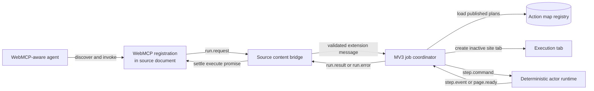
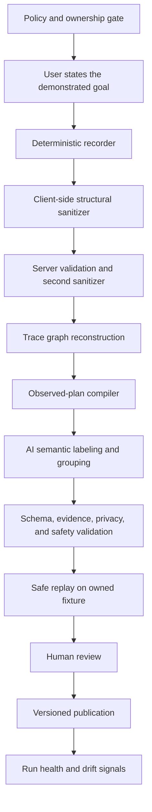

# MVP system contract

This document defines the overnight contract for learning and executing WebMCP
tools. It is deliberately narrower than a production automation platform.

## Decision

The product has two paths with one executable contract between them:

- the **learn path** turns an observed browser trace into a reviewed action map;
- the **ready path** exposes executable actions as WebMCP tools and interprets
  their deterministic steps in a separate browser tab.

AI may label, group, and generalize captured evidence during learning. AI is not
part of ready-path execution. A ready action either satisfies its explicit
preconditions and postconditions or fails with a structured error.

For this MVP, `action-map/1` is the canonical editable learning representation.
Published runtime capabilities are immutable `action-list/1` projections. The
paused `learned-adapter/1` representation is a migration format, not a second
source of truth; it must not evolve independently.

The detailed machine-readable schemas and component boundaries are in
[`contracts/`](contracts/), and the branch/worktree sequence is in
[`parallel-worktrees.md`](parallel-worktrees.md).

## Current baseline

The repository already has:

- a stepped `learning-trace/3` recorder;
- deterministic `page -> action -> update -> page` ordering;
- server-side trace validation, graph reconstruction, and sanitization;
- AI-assisted `action-map/1` discovery with strict output validation;
- a deterministic runner for `fill`, `click`, `press`, `wait`, and `extract`;
- an owned storefront for repeatable tests.

The ready path is not connected end to end. WebMCP registration is disabled in
`extension/content.js`, action-map discovery no longer produces active adapter
versions, and the current source page polls the service worker for job results.

## Ready-path architecture



### Ownership

1. **WebMCP registration** owns only tool lifecycle, input-schema exposure,
   cancellation, and promise settlement. It does not inspect or operate the
   target page.
2. **Source content bridge** is the trusted extension boundary in the calling
   tab. Prefer direct registration from the isolated content-script world when
   Chrome exposes `document.modelContext` there. If that is not discoverable by
   the WebMCP inspector, inject only a small main-world registration shim and
   treat every page-world message as untrusted.
3. **MV3 job coordinator** owns the persistent run state machine, execution-tab
   lifecycle, policy checks, cancellation, and result routing. It is an
   event-driven coordinator, not a long-lived worker process.
4. **Execution tab** is a real site document opened inactive in the user's
   browser profile. It owns page state and receives one deterministic command
   at a time.
5. **Actor runtime** resolves targets, executes primitives, verifies effects,
   and emits bounded observations. It does not call an LLM.
6. **Registry** stores versioned plans, policy decisions, provenance, and
   aggregate run health. It never sends arbitrary executable JavaScript to the
   extension.

An offscreen extension document is not the website execution surface. Chrome's
offscreen API is suitable for extension-owned DOM work, but the target site's
DOM, cookies, and application runtime belong in a real tab.

## Run state machine

The coordinator persists each transition before dispatching the next command:

```text
created
  -> policy_checked
  -> opening_tab
  -> waiting_for_page
  -> running_step[n]
  -> waiting_for_effect | waiting_for_navigation
  -> running_step[n + 1]
  -> extracting
  -> completed | failed | cancelled | awaiting_confirmation
```

No correctness rule may depend on an in-memory timer surviving service-worker
suspension. Navigation resumes from `PAGE_READY`; same-document operations
return a `STEP_COMPLETED` event; persisted state makes either event idempotent.

Every run has:

- `runId`, `requestId`, `planId`, and immutable `planVersion`;
- `sourceTabId`, `executionTabId`, and current `documentId`;
- `stepIndex`, status, timestamps, and cancellation state;
- a redacted event ledger and either a typed result or structured error.

## Messaging contract

Use events rather than 200 ms job polling. Extension-owned contexts use a named
`chrome.runtime.Port`; a main-world shim, if required, uses a minimal
`window.postMessage` bridge. Messages are JSON-serializable envelopes:

```json
{
  "protocol": "webmcp-run/1",
  "type": "run.request",
  "requestId": "req_...",
  "runId": "run_...",
  "sequence": 1,
  "sentAt": "2026-09-03T00:00:00Z",
  "payload": {}
}
```

Allowed message types are:

- `run.request`, `run.accepted`, `run.cancel`;
- `page.ready`;
- `step.command`, `step.completed`, `step.failed`;
- `run.awaiting_confirmation`, `run.result`, `run.error`.

Receivers reject unknown protocol versions, message types, stale document IDs,
duplicate sequence numbers with different payloads, and payloads that do not
match their schema. Duplicate identical events are acknowledged without
repeating the action.

The bridge carries no API keys, database credentials, raw action maps, or
unredacted traces. The host page can observe and forge main-world messages, so
the isolated content script and service worker remain authoritative.

## Action-step representation

JSON is the canonical format for the MVP because it provides schema validation,
stable versioning, diffable review, and direct WebMCP input-schema projection.
Do not build a custom parser tonight. A compact language may later be generated
from JSON for reading and editing, but it must round-trip through the same JSON
schema.

An executable action is a partial state transition:

```text
plan(current_page, typed_arguments) -> typed_result | structured_error
```

It may run only when its site, route, state, policy, and safety guards hold.
Each mutating primitive must be followed by evidence that distinguishes success
from an unchanged or wrong page.

### Recommended shape

The existing `action-map/1` action is close. The execution projection should
retain the following semantics:

```json
{
  "schemaVersion": "action-plan/1",
  "id": "demo.search_products",
  "version": 1,
  "site": {
    "origin": "http://127.0.0.1:4317",
    "routePatterns": ["^/demo/?$"]
  },
  "tool": {
    "name": "search_products",
    "description": "Search the catalog and return matching products.",
    "inputSchema": {
      "type": "object",
      "properties": {
        "query": { "type": "string", "description": "Catalog search text" }
      },
      "required": ["query"],
      "additionalProperties": false
    },
    "annotations": {
      "readOnlyHint": true,
      "untrustedContentHint": true
    }
  },
  "precondition": {
    "stateId": "catalog",
    "urlPattern": "^http://127\\.0\\.0\\.1:4317/demo/?$"
  },
  "steps": [
    {
      "id": "s1",
      "op": "fill",
      "target": {
        "cardinality": "one",
        "role": "searchbox",
        "name": "Search the catalog",
        "cssFallback": "#catalog-search"
      },
      "value": { "fromArgument": "query" },
      "expect": { "kind": "value_set" },
      "timeoutMs": 5000
    },
    {
      "id": "s2",
      "op": "click",
      "target": {
        "cardinality": "one",
        "role": "button",
        "name": "Search"
      },
      "expect": {
        "kind": "navigation",
        "urlPattern": "^http://127\\.0\\.0\\.1:4317/demo/search"
      },
      "timeoutMs": 10000
    },
    {
      "id": "s3",
      "op": "wait",
      "expect": {
        "kind": "collection",
        "target": { "role": "list", "name": "Search results" }
      },
      "timeoutMs": 10000
    }
  ],
  "output": {
    "mode": "collection",
    "item": { "role": "article" },
    "limit": 25,
    "fields": [
      { "name": "name", "locator": { "role": "heading" }, "required": true },
      { "name": "price", "locator": { "css": "[data-price]" }, "required": true },
      { "name": "url", "locator": { "role": "link" }, "attribute": "href", "required": true }
    ]
  },
  "safety": {
    "class": "read",
    "confirmation": "never",
    "idempotency": "safe"
  },
  "provenance": {
    "source": "demonstration",
    "observationCount": 1,
    "evidenceIds": ["transition_1", "transition_2"]
  }
}
```

The readable view is generated, for example:

```text
search_products(query) on catalog
  fill searchbox "Search the catalog" <- query
  click button "Search"
  expect navigation to /demo/search
  wait for collection "Search results"
  return each article { name, price, url }
```

### Primitive semantics

Keep the first execution profile small:

- `fill`: set a text, textarea, select, or content-editable value through the
  native setter and dispatch the expected input/change events;
- `click`: scroll one uniquely resolved target into view and invoke it;
- `press`: dispatch one allowlisted key to one target or the active element;
- `wait`: wait for a declared condition, never merely sleep for a guessed
  duration;
- `extract`: return a page object or repeated collection according to an output
  projection.

Add `select`, `check`, and `uncheck` only when a real target requires semantics
that `fill` cannot represent reliably. Keep uploads, downloads, clipboard,
cross-origin frames, and screenshots out of the first profile.

`send results` is a transport responsibility, not an actor primitive. `get
values` and `get items` are both `extract` with different output projections.

The screenshot experiment should return an opaque extension or server asset ID,
not a page-owned `blob:` URL. It needs an explicit capture boundary, short TTL,
access control, and a privacy review before it can leave the browser.

### Locator rules

- Resolve semantic evidence as a conjunction: role plus accessible name, label,
  placeholder, or stable attribute.
- CSS is an ordered fallback, not an automatic first choice when it looks
  generated.
- Every single-target operation requires exactly one visible, enabled match.
- Zero matches and ambiguous matches are different typed failures.
- Geometry may break ties only during learning; it is not a published locator.
- A model may select captured locator evidence by ID. It may not invent a
  selector string.

### Result and failure contract

Successful tools return JSON with `ok`, `runId`, `planVersion`, `data`, and a
bounded `evidence` summary. Failures return a code such as `POLICY_BLOCKED`,
`PRECONDITION_FAILED`, `TARGET_NOT_FOUND`, `TARGET_AMBIGUOUS`,
`POSTCONDITION_FAILED`, `CONFIRMATION_REQUIRED`, `CANCELLED`, or
`EXECUTION_TAB_CLOSED`, plus `stepId` and redacted observations.

Do not silently choose the first target, retry a state-changing step after an
uncertain result, or claim success from the absence of an exception.

## Learn-path architecture



### Learning invariants

1. Capture is deterministic. AI does not decide what happened.
2. The user supplies a goal before recording so the compiler does not have to
   infer the entire action boundary from incidental browsing.
3. The browser emits causal frames and stable evidence IDs. The server rebuilds
   the graph rather than trusting a client-supplied graph.
4. A deterministic compiler first creates an observed skeleton from exact
   transitions. The model may name, group, parameterize, and choose among
   captured evidence IDs.
5. Every generated step cites trace evidence. A step without evidence is
   unresolved and cannot be published.
6. Read-only plans may be replay-tested automatically on owned fixtures. Write
   and danger plans require a sandbox or a human confirmation boundary.
7. Publication is versioned and reversible. Runtime failures can degrade or
   quarantine a version but cannot silently rewrite it.

The state model is a labeled directed multigraph. A node is a materially
distinct semantic page state. An edge is an observed action with parameters,
ordered primitives, and a postcondition. Multiple edges may connect the same
states, and loops are valid. A published action plan is a guarded path through
that graph, not free-form browser control.

## Privacy, terms, and safety gates

### Privacy

Do not remove all node values and attributes indiscriminately. That would also
remove accessible names, stable labels, result fields, and state evidence needed
to learn or execute the tool.

Use an allowlist instead:

- typed values become parameter placeholders in the browser before upload;
- passwords, payment fields, tokens, account identifiers, and form values stay
  local;
- only semantic attributes needed for resolution are retained;
- server-side sanitization repeats the checks before storage and model calls;
- model-provider guardrails are defense in depth, not the privacy boundary;
- regression fixtures test that private values cannot cross either boundary.

### Terms policy

A single `termsDoesNotDisallow` boolean is insufficient. Use a fail-closed,
versioned decision:

```json
{
  "status": "allowed | denied | unknown",
  "scope": ["learn", "inject", "read", "write", "danger"],
  "basis": "site_owner | written_permission | reviewed_terms | local_fixture",
  "evidenceUrl": "https://example.com/terms",
  "checkedAt": "2026-09-03T00:00:00Z",
  "expiresAt": "2026-10-03T00:00:00Z"
}
```

Unknown and expired decisions do not inject or learn. The overnight build uses
an explicit owned-origin allowlist; a universal reviewed registry can follow.

### Safety

- `read`: may execute without a product-level confirmation, though returned
  content remains untrusted;
- `write`: must show the exact intended mutation before the first committing
  step;
- `danger`: must hand off at the final boundary and require an explicit human
  confirmation immediately before purchase, deletion, submission, payment, or
  message sending.

## Overnight cut line

The credible target is one owned-site vertical slice, not Amazon and Devpost.

### Must work

1. Deterministically project one observed `action-map/1` action into the runtime
   adapter shape while preserving expectations.
2. Enable WebMCP registration on the owned demo and verify it with the inspector.
3. Replace source-page polling with run result events, or keep polling only as a
   temporary fallback behind the same message contract.
4. Execute `search_products(query)` in an inactive demo tab across navigation.
5. Return structured product JSON to the WebMCP caller.
6. Emit the run event ledger and one precise failure when a target or
   postcondition is wrong.
7. Demonstrate record -> discover -> review -> publish -> invoke -> result on the
   owned storefront.

### Parallel tracks after this contract freezes

- **Track A — registration and transport:** WebMCP lifecycle, cancellation,
  run-event channel, and promise settlement.
- **Track B — actor and execution:** primitive semantics, target cardinality,
  postconditions, navigation resume, and structured extraction.
- **Track C — compiler and registry:** action-map-to-runtime projection,
  publication, origin/route matching, policy gate, and versioning.
- **Track D — learning quality:** goal capture, evidence-ID-only compilation,
  client sanitizer, and owned-site replay fixture.
- **Track E — integration:** one fixed demo plan and the full browser smoke test.

Tracks A through D share only the JSON schemas and event envelopes above. Track
E starts immediately with a hand-authored fixture, then swaps in the learned
plan when Track C connects publication.

### Explicitly deferred

- Amazon search and ordering;
- Devpost automation;
- screenshots or temporary image URLs;
- multi-user universal publication;
- automatic merging of several demonstrations;
- self-healing selectors;
- arbitrary-site write or danger actions.

These are later validations of the architecture, not prerequisites for proving
the architecture.
