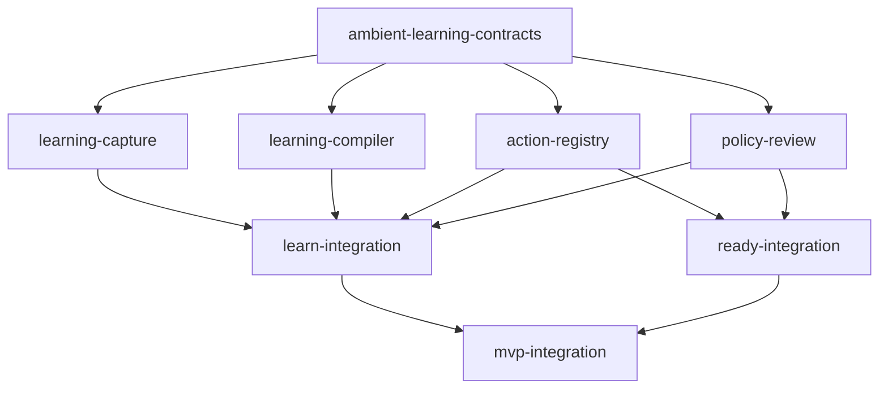

# Parallel worktree execution plan

This plan assigns the fully automatic ambient-learning contract to independent
owners without splitting a correctness invariant across branches.

## 1. Frozen base and branch rule

The verified pre-contract base is:

```text
extension-seams
055a97faeaae2c603c8609fb085ebbbb864b4975
```

The contract slice is developed on the plain branch
`ambient-learning-contracts`. Its resulting commit is referenced below as
`<ambient-contract-sha>` because a commit cannot contain its own SHA.

Every dependent owner must merge or rebase `<ambient-contract-sha>` before
implementing the contract. Existing worktrees do not need to be recreated, but
they must record both their original base and the contract commit in the
handoff. No owner may copy a schema into its own branch or implement the old
goal-led/manual-recording contract behind a compatibility name.

No branch is pushed by this plan. Push, integration, and deployment require
separate explicit authorization.

## 2. Contract kernel

All owners consume these exact versions:

| Contract | Producer | Primary consumers |
|---|---|---|
| `semantic-ui/2` | ambient capture | parser/compiler |
| `ambient-parse-request/1` | request assembler | parser/compiler |
| `action-map-patch/1` | AI parser/compiler | deterministic validator, persistence |
| `action-map-revision/1` | persistence/API | capture retry queue, parser, UI, integration |
| `action-map/1` | patch materializer | context projector, action-list compiler, review UI |
| `action-list/1` | action-list compiler/publication | ready-path registry and runtime |
| `webmcp-run/1` | ready-path contexts | coordinator, actor, source bridge |

`action-map/1` and `action-list/1` are unchanged. The patch envelope carries
incremental provenance, evidence bindings, and composition lineage. Applying a
patch must materialize a valid `action-map/1` document. Runtime consumes only a
validated published `action-list/1` revision.

The historical `learning-trace/3` path remains for replay and migration
fixtures. It is not the ambient parser request and must not reintroduce a user
goal or manual session gate.

## 3. Dependency graph



Wave 1 begins after the contract commit and runs in parallel:

- ambient capture/privacy;
- incremental AI parser/compiler;
- action-map/list persistence/API;
- policy and revision-review UI; and
- ready-path owners whose interfaces are unchanged.

Wave 2 is `learn-integration`. It begins as soon as the capture fixture, fake
parser, and in-memory revision store are available; it does not wait for UI
polish or a live provider.

Wave 3 is `mvp-integration`, combining the accepted ambient revision path with
the already independent ready path.

## 4. Ownership matrix

| Branch | Owns | Must not edit |
|---|---|---|
| `ambient-learning-contracts` | `documentation/contracts/**`, `documentation/mvp-system-contract.md`, `documentation/parallel-worktrees.md`, contract fixtures/tests | runtime behavior |
| `learning-capture` | `extension/learning/**`, capture/privacy tests, local retry spool adapter | server persistence, model client, action schemas, user-facing record controls |
| `learning-compiler` | parser request assembly, compact context adapter, model adapter, patch validation/materialization tests, action-list compiler | capture lifecycle, registry transactions, schemas |
| `action-registry` | action-map/list revision tables, compare-and-append API, digests, safe evidence metadata, context projection reads | capture code, model prompts, raw/sanitized observation storage |
| `policy-review` | ambient eligibility/revoke UI, revision/provenance review, local-spool deletion UI, confirmation UI | enforcement, persistence internals, goal/record/start/stop controls |
| `learn-integration` | queue/API wiring, shared bootstraps, test indexes, cross-owner fixtures | redefining contracts or absorbing owner internals |
| `ready-integration` | ready-path composition and shared runtime wiring | ambient source capture/parser semantics |
| `mvp-integration` | final end-to-end wiring, clean-reset test, demo documentation | silent schema or privacy-boundary changes |

Shared hotspots are integration-owned:

- `extension/background.js`, `extension/content.js`, and
  `extension/manifest.json`;
- extension test index/bootstrap registration;
- `server/internal/api/server.go` routing composition;
- root `Makefile`; and
- cross-module fixture indexes.

Feature owners add modules and focused tests. Integration owners make the thin
shared-file edits after consuming the feature commits.

## 5. Owner contracts

### A. `learning-capture` — ambient capture and privacy

Inputs:

- current normalized origin/route;
- a current `ambient_learn` policy decision;
- top-level document lifecycle;
- user-generated events and resulting semantic updates/navigation.

Output:

```text
CompletedLayer {
  siteScope,
  layer,
  observation | null,
  policy,
  privacy
}
```

Required behavior:

1. Attach only after policy allows capture.
2. Treat `start`/`stop` as internal document/policy lifecycle primitives.
3. Expose no learning goal and no user-operated record control.
4. Build the semantic allowlist projection without serializing raw DOM/history.
5. Complete the initial page and every user-effect/navigation layer.
6. Enqueue every completed meaningful layer; do not score novelty or wait for
   multiple events.
7. Preserve causal order and include exactly one leading observation after the
   initial layer.
8. Mark and exclude deterministic actor events/background tabs.
9. Keep raw material in memory only; enforce the 30-second incomplete-layer
   limit and 24-hour sanitized local-spool hard TTL.
10. Delete delivered source material after `applied`, `duplicate`, or
    `no_change`; retain on conflict only long enough for a reparse.

Contract tests:

- initial layer with `observation: null`;
- equal XML digest after two distinct observations creates two requests;
- click + SPA update and click + navigation preserve causal order;
- policy revocation disconnects capture and blocks queued transfer;
- seeded secrets never enter serialized layer/observation data;
- synthetic events are ignored; and
- no goal/record/start/stop UI message exists.

Handoff to parser/integration: a deterministic fake `CompletedLayer` stream
matching the X and Orders fixtures.

### B. `learning-compiler` — incremental parser and compiler

Inputs:

- `CompletedLayer`;
- exact action-map head revision/digest;
- compact context read for that revision; and
- parser/provider configuration.

Outputs:

- `ambient-parse-request/1`;
- validated `action-map-patch/1` or typed rejection;
- action-list candidate from an exact accepted map revision.

Required behavior:

1. Invoke one parse for every completed layer.
2. Send current semantic XML, causal observation when present, and compact
   context only.
3. Never add a goal or expand every prior action's steps/locators into context.
4. Require every AI action to have at least one step, empty missing evidence,
   and `resolvable`/`observed` status.
5. Require semantic node/evidence bindings for clicks and extraction fields.
6. Allow page XML alone to infer executable actions.
7. Use observations to upgrade provenance, connect states, and flatten
   composite paths.
8. Return explicit `no_change` with citations when a parsed layer adds no
   semantics; do not create a fake upsert or skip the parse.
9. Preserve full executable steps and target binding tokens on the action-map
   entry and revision sidecar.
10. Reject invented evidence, unsupported primitives, unsafe effects, private
   literals, and invalid materialized `action-map/1` results.
11. On base conflict, re-read compact context and reparse the same source layer
    with a new request/key linked by `retryOf`.
12. Provide a deterministic fake parser; CI must not require provider/network.

Contract tests:

- X page yields `Open Posts` and `Get recent posts` without an observation;
- Account page yields inferred `Open orders`;
- Orders result layer upgrades `Open orders`, yields page-local `Get recent
  orders`, and composes higher-level `Get recent orders`;
- missing step, unbound click, unbound output, invented evidence, prompt
  injection, private literal, stale verification, and malformed JSON fail; and
- compact context contains semantics/evidence handles but no steps/locators.

Handoff to persistence/integration: fake parser outputs matching the contract
fixtures plus field-addressed rejection fixtures.

### C. `action-registry` — persistence and API

Inputs:

- bound `action-map-patch/1` and source request identity;
- `action-list/1` candidate/publication transactions; and
- privacy-safe verification/run metadata.

Outputs:

- `action-map-revision/1` receipts;
- exact map head/revision reads;
- compact context projections;
- existing action-list discovery/publication reads.

Required behavior:

1. Compare base revision and digest transactionally.
2. Apply canonical state/action ordering to an in-memory copy.
3. Validate evidence bindings, provenance, executable actions, privacy, and the
   full materialized `action-map/1`.
4. Append an immutable canonical revision and digest atomically.
5. Return the original receipt for an exact idempotent duplicate.
6. Reject key reuse with changed input and conflict on stale base; never use
   last-write-wins.
7. Project compact context without steps, locators, XML, or observations.
8. Store only map/list revisions and safe evidence metadata in Universal DB.
9. Reject schema columns/payload fields for semantic XML, raw or sanitized
   observations, prompt bodies, typed values, or browsing history.

Minimum API:

```text
GET  /v1/action-maps/{scopeId}/head
GET  /v1/action-maps/{scopeId}/context?revision=<n>
POST /v1/action-maps/{scopeId}/patches
GET  /v1/action-maps/{scopeId}/revisions/{revision}
```

Contract tests:

- append revision 1 and 2 from the Orders fixtures;
- exact duplicate returns the first receipt and count remains unchanged;
- two concurrent patches on one base produce one apply and one conflict;
- stale revision/digest, stale layer, and reused key fail;
- context contains no step/locator/XML/observation fields; and
- Universal DB writes pass a strict storage-field allowlist.

Handoff to parser/UI/integration: in-memory and database-backed implementations
of the four endpoints with the fixture receipts.

### D. `policy-review` — eligibility and revision UI

Inputs:

- normalized site scope and policy source;
- action-map head/revision/context;
- replay/review state; and
- local retry-spool counts/deletion action.

Outputs:

- allow/block/revoke decisions for `ambient_learn`;
- review/publication decisions for exact digests; and
- local-spool delete requests.

Required behavior:

1. Show allowed, blocked, expired, and revoked site scope clearly.
2. Do not expose a user goal, learning start/stop, or recording button.
3. Explain inferred/observed/verified provenance and evidence handles without
   exposing private event history.
4. Bind review decisions to exact action-map/list digests.
5. Keep consequential ready-path confirmation separate from ambient capture.
6. Never enforce policy or write publication rows directly; call authoritative
   coordinator/registry interfaces.

Contract tests: allow/block/revoke, stale decision, exact digest review, no
recording controls, masked sensitive data, and local-spool deletion.

### E. `learn-integration` — ambient composition

Dependencies: A, B, C, and the eligibility/revision slice of D.

Integration order:

1. policy-before-attach adapter;
2. capture `CompletedLayer` queue;
3. head/context request assembly;
4. deterministic fake parser, then configured live parser behind the same
   interface;
5. compare-and-append revision API;
6. provenance/revision UI; and
7. action-list compile/replay/review/publication.

The integration owner must preserve exact contracts at each adapter. If an
owner disagrees with a schema, work stops for a focused contract patch; the
integration branch does not translate two incompatible meanings silently.

Required end-to-end tests:

- initial account page automatically yields revision 1 with `Open orders`;
- clicking Orders yields revision 2 with observed linkage, page-local
  extraction, and flattened `Get recent orders` composition;
- exact retry is idempotent;
- injected concurrent update returns a conflict and successful reparse;
- private canaries are absent from parser logs and Universal DB;
- deleting source spool material does not delete accepted revisions; and
- no user goal or recording lifecycle is involved.

## 6. Ready-path relationship

The ready-path worktrees remain independently owned:

- `actor-runtime` interprets `action-list/1` primitives;
- `source-webmcp-bridge` registers/invokes tools;
- `run-coordinator` persists run state and drives an execution tab;
- `action-registry` publishes and serves exact action-list revisions;
- `policy-review` supplies confirmation/review UI; and
- `ready-integration` composes them.

Ambient learning changes only how candidate action-map revisions are created.
It does not add an LLM to execution and does not allow unreviewed action maps to
reach the ready runtime.

## 7. Worktree commands and update rule

For a new worktree after the contract commit:

```bash
git worktree add -b <branch> <absolute-worktree-path> <ambient-contract-sha>
```

For an existing feature worktree that already contains work based on
`055a97f`, inspect its state first, then merge or rebase the contract commit by
an explicit owner-approved workflow. Never force-reset it to the contract SHA.

Before editing, every owner records:

```text
Repository: /Users/elijahkolawole/code/webmcp-automator
Original base: 055a97faeaae2c603c8609fb085ebbbb864b4975
Contract commit: <ambient-contract-sha>
Branch: <owned branch>
Starting state: <clean or exact existing changes>
Owned paths: <from matrix>
Contracts implemented: <versions>
```

Contract changes after Wave 1 starts require a focused commit that updates:

1. the relevant schema;
2. positive and negative fixtures;
3. deterministic contract tests;
4. compatibility notes for `action-map/1` and `action-list/1`; and
5. every active owner handoff.

## 8. Handoff contract

Every branch handoff must include:

```text
Branch:
Original base SHA:
Ambient contract SHA:
Head SHA:
Contracts implemented:
Files owned/changed:
Public interfaces added:
Retention/storage behavior:
Tests run and exact results:
Positive fixtures demonstrated:
Negative/conflict cases demonstrated:
Known limitations:
Integration wiring requested:
Schema change requested: none | commit
```

The integration owner rejects a handoff if it:

- omits `<ambient-contract-sha>` or implements an older contract;
- adds goal/session/record controls to ambient learning;
- suppresses a completed layer by novelty/confidence/evidence count;
- emits an action with zero steps or unresolved evidence;
- cannot map click/extraction targets to semantic evidence IDs;
- persists XML, observations, prompt bodies, or browsing history in Universal
  DB;
- relies on uncommitted files from another worktree;
- edits an unowned hotspot; or
- lacks retry, duplicate, conflict, and privacy tests.

## 9. Integrated success

The learning chain is complete when this passes twice from a clean local state:

```text
eligible page load
 -> automatic privacy-sanitized semantic layer
 -> one no-goal parse request
 -> executable page-inferred action-map patch
 -> immutable revision receipt
 -> observed event + resulting semantic layer
 -> provenance/path/composition patch
 -> idempotent next revision
 -> action-list compile + replay + review + publication
 -> ready-path WebMCP registration and deterministic execution
```

The demonstration must also show that the local source spool is deleted after
receipt, accepted revisions remain, and Universal DB contains safe evidence
metadata rather than browsing history.
