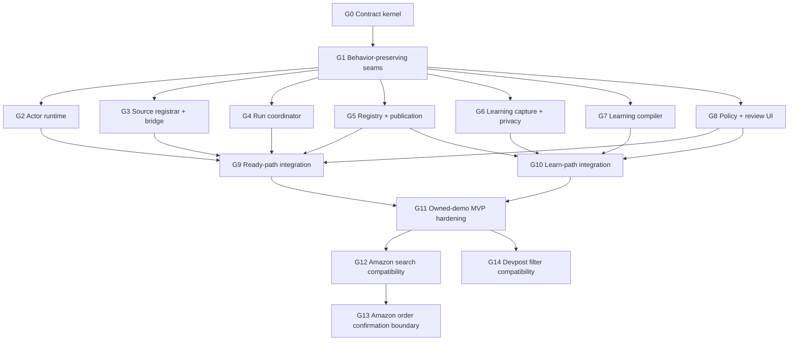

# Parallel worktree execution plan

This is the implementation sequence for turning the current partial demo into
one end-to-end owned-site WebMCP system. It is designed for several developers
or agents working simultaneously without sharing uncommitted files or silently
changing each other's contracts.

The branches below are proposed names. Creating, committing, merging, and
pushing them is a separate execution step; this document does not claim those
branches are already complete.

## 1. The unit boundaries

Some parts should be developed and tested together because separating them
would put one correctness invariant across two owners. Other parts can safely
run in parallel once the contract kernel is frozen.

### Keep these together as one unit

1. **Schemas + semantic validators + shared fixtures**

   The JSON shape alone is not the contract. Cross-reference, safety, digest,
   state, and evidence rules must evolve with the fixtures and JS/Go validators.
   Splitting these produces two definitions of a valid action.

2. **WebMCP registrar + source-page bridge + promise lifecycle**

   Registration, invocation correlation, cancellation, and promise settlement
   cross the page-world/isolated-world trust boundary. They need one owner and
   one adversarial test suite.

3. **Coordinator + persistent job state + execution-tab lifecycle**

   Background processing is the run state machine. Tab creation, service-worker
   recovery, sequence handling, dispatch, and cancellation cannot be separate
   collections of callbacks. This is also where the efficient event channel is
   made correct.

4. **Locator engine + actor primitives + postconditions + extraction**

   A click is not complete until the effect verifier says so, and extraction is
   meaningful only under the same locator/cardinality rules. These form one
   deterministic interpreter.

5. **Registry API + storage + publication transaction**

   Immutable revisions, digest checks, replay reports, and policy gates need one
   transactional owner. An API that claims publication before storage enforces
   it is unsafe.

6. **Recorder + client-side privacy filter**

   Sanitization must happen at capture time, before trace serialization. A
   recorder that emits secrets for another module to remove later violates the
   privacy boundary.

7. **Trace validator + graph builder + observed-plan compiler**

   These stages share evidence identity and chronology. The compiler may only
   use facts preserved by the graph, so they should share fixtures and one
   server-side owner. The optional AI semanticizer is an adapter inside this
   unit, not the authority for graph truth.

8. **Policy explanation + confirmation UI**

   Both present why an action is allowed or paused and both must use the same
   redaction and stale-decision rules. The coordinator owns enforcement; this
   unit owns explanation and explicit input.

### Safe to build in parallel after the seam pass

- actor runtime;
- source registrar/bridge;
- run coordinator/background processing;
- registry/publication backend;
- learning capture/privacy;
- learning compiler/semanticizer;
- policy and confirmation UI.

They communicate only through the frozen action-list, run-message, trace,
action-map, and policy contracts.

### Do not split these into separate branches tonight

- one branch for “messaging” and another for “background processing”;
- one branch for click/fill and another for locator/postcondition behavior;
- one branch for database tables and another for publication endpoints;
- one branch for recorder output and another for client redaction;
- separate Amazon and Devpost work before the owned-demo runtime passes.

Those splits create integration work larger than the original implementation.

## 2. Branching rules

1. Finish and validate the contract commit first.
2. Finish a short behavior-preserving extension seam commit second.
3. Record that seam commit SHA as `<parallel-base-sha>`.
4. Create every Wave 1 worktree from that exact SHA.
5. Each branch owns only the paths listed here. Shared bootstrap files are
   edited once on an integration branch.
6. A branch that needs a contract change stops and proposes a contract patch;
   it does not add a private field or protocol variant.
7. Every branch hands off a small commit series, tests run, failure cases, and
   known limitations. Do not hand off a large unvalidated working tree.
8. Integration happens into a dedicated integration branch. `main` receives
   only the tested integrated slice.
9. Do not merge feature branches into each other. Rebase/merge the shared base
   or let the integration owner combine them.
10. Keep Amazon and Devpost recordings, account data, and site-specific values
    out of the shared fixtures and Git history.

Suggested worktree parent:

```text
/Users/elijahkolawole/code/webmcp-worktrees/
```

After the contract and seam commits exist, setup would look like:

```bash
mkdir -p /Users/elijahkolawole/code/webmcp-worktrees
git rev-parse HEAD
git worktree add -b actor-runtime /Users/elijahkolawole/code/webmcp-worktrees/actor-runtime <parallel-base-sha>
git worktree add -b source-webmcp-bridge /Users/elijahkolawole/code/webmcp-worktrees/source-webmcp-bridge <parallel-base-sha>
git worktree add -b run-coordinator /Users/elijahkolawole/code/webmcp-worktrees/run-coordinator <parallel-base-sha>
git worktree add -b action-registry /Users/elijahkolawole/code/webmcp-worktrees/action-registry <parallel-base-sha>
git worktree add -b learning-capture /Users/elijahkolawole/code/webmcp-worktrees/learning-capture <parallel-base-sha>
git worktree add -b learning-compiler /Users/elijahkolawole/code/webmcp-worktrees/learning-compiler <parallel-base-sha>
git worktree add -b policy-review /Users/elijahkolawole/code/webmcp-worktrees/policy-review <parallel-base-sha>
```

Do not substitute the current `main` SHA for `<parallel-base-sha>`; the purpose
is to give every branch the same frozen contracts and extracted seams.

## 3. Dependency map



The long poles are G4 coordinator recovery and G9 integration. Give those to
the strongest state-machine/debugging owner. G2 and G5 have the cleanest
independent boundaries. G6 and G7 can start at the same time because they meet
at `learning-trace/3` rather than shared code.

## 4. File ownership matrix

The seam pass creates the new files named below. Until it lands, current
`extension/content.js` and `extension/background.js` are conflict hotspots.

| Branch | Owns | Must not edit |
|---|---|---|
| `system-contracts` | `documentation/contracts/**`, contract docs | runtime behavior |
| `extension-seams` | thin `content.js`, thin `background.js`, test/module bootstraps | protocol semantics |
| `actor-runtime` | `extension/actor/**`, actor unit tests | `content.js`, `background.js`, `manifest.json`, popup, server |
| `source-webmcp-bridge` | `extension/source/**`, source tests | actor, coordinator, `manifest.json` |
| `run-coordinator` | `extension/coordinator/**`, coordinator tests | source, actor, popup, server, `manifest.json` |
| `action-registry` | `server/internal/manifest/**`, `server/internal/store/**`, registry API handlers/tests/migrations | learning packages, extension |
| `learning-capture` | `extension/learning/**`, recorder/privacy browser tests | ready runtime, server, `manifest.json` |
| `learning-compiler` | `server/internal/trace/**`, `privacy/**`, `actionmap/**`, `learning/**`, compiler tests | registry store/API, extension |
| `policy-review` | `extension/ui/**`, popup files, UI tests | coordinator enforcement, registry persistence |
| integration branches | `extension/manifest.json`, root `Makefile`, test indexes, bootstraps, cross-module fixtures | schema changes without contract pass |

Special collision rules:

- `extension/manifest.json` is integration-owned because almost every extension
  branch may need a new script. Feature branches document the desired order in
  their handoff and do not edit it.
- `extension/tests/index.html` is integration-owned. Feature branches add
  independent test files; integration adds them to the browser test loader.
- `server/internal/api/server.go` is owned by the registry branch for Wave 1.
  The learning compiler exposes package functions and fixtures, not new routes.
- `server/go.mod`, root `Makefile`, and shared READMEs change only during
  integration unless a new dependency is absolutely required.

## 5. Goal series

### G0 — Freeze the contract kernel

Branch: `system-contracts`.

Objective: make every parallel owner implement the same action and message
semantics.

Deliverables:

- strict Draft 2020-12 action-list schema;
- strict run-message schema;
- valid owned-storefront list and lifecycle examples;
- semantic-rule checklist;
- full component contract and this worktree plan;
- JS and Go validation implementation plan with positive/negative fixture list.

Validation:

```bash
python3 -m json.tool documentation/contracts/action-list.schema.json
python3 -m json.tool documentation/contracts/run-message.schema.json
make test-documentation
git diff --check
```

Done when:

- both schemas pass their meta-schema;
- the owned-storefront action list validates;
- every example run message validates, including its external step reference;
- action IDs, state IDs, confirmation, safety, provenance, and digest semantics
  have one written meaning;
- all branch owners accept the frozen base.

Estimated focused time: 45–75 minutes.

### G1 — Extract extension seams without changing behavior

Branch: `extension-seams`, based on G0.

Objective: turn the two monolithic shared files into thin composition roots so
parallel branches add modules instead of editing the same files.

Deliverables:

```text
extension/content.js                 thin context bootstrap only
extension/background.js              thin service-worker bootstrap only
extension/shared/protocol.js          constants and envelope helpers
extension/shared/errors.js            public error helpers
extension/source/bootstrap.js         existing source behavior adapter
extension/coordinator/bootstrap.js    existing background behavior adapter
extension/learning/bootstrap.js       existing recorder behavior adapter
extension/tests/test-harness.js        reusable assertions/fixtures
```

Rules:

- move existing code mechanically; do not enable WebMCP registration;
- do not replace polling yet;
- keep current message names through compatibility wrappers;
- capture before/after browser tests to prove no behavior change;
- integration files become intentionally thin and remain integration-owned.

Done when existing extension tests and owned-demo behavior pass unchanged and
the Wave 1 modules can be added without editing `content.js` or `background.js`.

Estimated focused time: 30–60 minutes. This is serial and should stay small.

### G2 — Deterministic actor runtime

Branch/worktree: `actor-runtime` / `actor-runtime`.

Objective: implement the complete version-1 action interpreter independent of
WebMCP, background tabs, and server availability.

Inputs:

- one `action-list/1` action;
- one `step.command`;
- typed arguments;
- current document and abort signal.

Outputs: `step.completed` or `step.failed` payloads.

Tasks:

1. Extract/adapt current runner behavior into `extension/actor/`.
2. Implement ordered role/name, label, test-id/stable-attribute, and CSS
   fallback strategies supported by the schema.
3. Enforce zero/one/many cardinality, visible, enabled, and item scoping.
4. Implement `fill`, `click`, `press`, `wait`, and `extract` exactly as the
   schema defines.
5. Implement conditions for URL, element, collection, state, target value, DOM
   change, and DOM stability.
6. Resolve argument placeholders without string interpolation or `eval`.
7. Enforce step/action timeout and abort.
8. Produce bounded before/after effects and public error codes.

Tests:

- one positive and at least one negative case per primitive and condition;
- ambiguous target never picks first;
- collection fields remain scoped to each product card;
- a click without a passing effect fails;
- SPA mutation and full navigation are distinguished;
- abort during wait prevents later steps;
- no network/LLM calls.

Done when the owned-storefront action runs against an in-page fixture through a
direct actor API and returns structured products.

Estimated focused time: 2–3 hours. Can start immediately after G1.

### G3 — WebMCP registrar and source bridge

Branch/worktree: `source-webmcp-bridge` / `source-webmcp-bridge`.

Objective: register published actions as WebMCP tools and turn each invocation
into one correlated event-driven extension request.

Tasks:

1. Verify whether `document.modelContext` registration is discoverable from an
   isolated content script in the target Chrome build.
2. If not, create the smallest main-world registrar shim; keep plans and
   privileged APIs in the isolated world.
3. Project public `tool` metadata only.
4. Validate arguments before sending `run.request`.
5. Open one named runtime port and implement acknowledgment, reconnect, and
   idempotent resend for unacknowledged messages.
6. Correlate concurrent requests and settle each promise once.
7. Forward cancellation through `run.cancel`.
8. Unregister or refresh tools when URL, policy, or list digest changes.

Tests:

- duplicate initialization registers once;
- two concurrent requests get the correct result;
- forged `window.postMessage` payload cannot choose a plan or result;
- invalid arguments never reach the worker;
- cancellation and navigation reject the right promise;
- port reconnect does not duplicate a run.

Done when a fake coordinator can receive an owned-demo tool call and return a
typed result through the real WebMCP registration promise.

Estimated focused time: 2–3 hours. Can start immediately after G1.

### G4 — Durable run coordinator and background processing

Branch/worktree: `run-coordinator` / `run-coordinator`.

Objective: replace polling with an event-driven, persisted run state machine
that safely operates a separate execution tab.

Tasks:

1. Implement the persisted run record and legal-transition reducer.
2. Accept validated source ports and bind requests to sender tab/document.
3. Resolve an exact action digest through an injected registry interface.
4. Recheck policy before opening a tab.
5. Create/reuse an inactive site tab and track tab/document navigation.
6. Dispatch one step at a time and persist before dispatch.
7. Handle `page.ready`, step completion/failure, confirmation, cancellation,
   timeout, tab closure, source closure, and service-worker restart.
8. Cache command/event digests for idempotent duplicate handling.
9. Send one terminal result/error and create a redacted run observation.
10. Retain the old polling API only behind a temporary compatibility adapter;
    the WebMCP path must not poll.

Tests use fake tabs/storage/ports and suspend the coordinator after every state.
The highest-value test is: click dispatch persisted -> worker disappears -> page
navigates -> new document announces ready -> run resumes at next step without
clicking again.

Done when an in-memory/fake-browser scenario completes and all recovery paths
terminate exactly once.

Estimated focused time: 3–4 hours. Start first and assign the strongest owner.

### G5 — Action-list registry and publication backend

Branch/worktree: `action-registry` / `action-registry`.

Objective: store and serve immutable, validated action-list revisions with a
real publication gate.

Tasks:

1. Add canonical action-list validation on ingestion and retrieval.
2. Migrate/replace paused `learned-adapter/1` storage as an action-list
   projection without creating a second source of truth.
3. Add immutable list/revision/publication/policy/replay-report tables.
4. Implement origin/route-filtered discovery and exact revision lookup.
5. Implement compare-and-publish with digest, policy, replay, and review checks.
6. Return ETag/digest and support conditional reads for efficient discovery.
7. Accept privacy-safe terminal observations.
8. Keep current `/api/*` callers working through explicit migration adapters
   until G9 removes them from the runtime path.

Tests:

- append-only revisions and deterministic canonical digest;
- exact-origin and route matching;
- candidate is never returned to ready runtime;
- stale expected digest cannot publish;
- failed replay or blocked policy cannot publish;
- concurrent publish attempts have one winner;
- no arbitrary JS field can pass schema validation.

Done when the owned-storefront sample can be inserted, reviewed, published, and
retrieved by exact digest through the target API.

Estimated focused time: 2–3 hours. Can start immediately after G1.

### G6 — Learning capture and client privacy

Branch/worktree: `learning-capture` / `learning-capture`.

Objective: turn a real owned-demo user demonstration into a deterministic,
sanitized `learning-trace/3` without contaminating the ready runtime.

Tasks:

1. Move current recorder/semantic extraction into the learning module boundary.
2. Add explicit start/stop session state and clear recording indicator.
3. Preserve `page -> action -> update -> page` ordering across SPA and full
   navigation.
4. Apply allowlist-based semantic capture and client-side redaction before
   serialization.
5. Replace input values with typed argument tokens while keeping originals only
   in ephemeral local memory where necessary.
6. Mark synthetic actor events so replay is not learned as a user demo.
7. Add a downloadable/local debug trace with redaction ledger summaries, never
   secret values.

Tests seed unique secrets into visible text, form values, attributes, query
parameters, and mutations, then assert those tokens are absent from every
serialized frame.

Done when one manual storefront search creates a valid sanitized trace matching
the server fixture chronology.

Estimated focused time: 2–3 hours. Can start immediately after G1.

### G7 — Learning graph, semanticizer, and plan compiler

Branch/worktree: `learning-compiler` / `learning-compiler`.

Objective: deterministically convert accepted evidence into a candidate action
list, with AI limited to evidence-backed semantic proposals.

Tasks:

1. Tighten trace chronology and server-side privacy validation.
2. Preserve deterministic graph construction as the first stage.
3. Define the minimized semanticizer input and strict structured output.
4. Require every AI-proposed state/action/argument/locator to cite evidence.
5. Reject invented transitions, unsupported operations, and reconstructed
   sensitive values.
6. Compile the action map into `action-list/1` with conservative safety class,
   explicit conditions, and output projection.
7. Return field-addressed diagnostics suitable for the review UI.
8. Provide a deterministic fake semanticizer so CI has no network dependency.

Tests:

- current storefront trace compiles to the shared sample semantics;
- shuffled frames fail;
- prompt injection in page text remains inert evidence;
- invented evidence IDs fail;
- an unobserved purchase/submit step cannot be created;
- unsupported locator or missing postcondition fails;
- fake and real semanticizers pass through the same validator.

Done when the owned demo trace produces a schema-valid candidate action list
whose every consequential field can be traced to evidence.

Estimated focused time: 2–3 hours. Can start immediately after G1.

### G8 — Policy, terms, confirmation, and review UI

Branch/worktree: `policy-review` / `policy-review`.

Objective: make site eligibility and consequential effects explicit to the
user, with deny-by-default behavior.

Tasks:

1. Display origin policy state, source, scope, checked/expiry time, and reason.
2. Allow an explicit local override for the owned demo only; keep it auditable.
3. Show candidate readable steps, evidence links, safety class, and replay
   status before publication.
4. Implement exact run/step confirmation with sensitive argument masking.
5. Detect stale confirmation when digest, step, origin, or document changes.
6. Provide clear blocked/unknown/expired states and no hidden auto-approval.

Important boundary: this branch does not enforce policy and does not publish by
writing directly to storage. It calls coordinator/registry interfaces; those
components remain authoritative.

Done when an owned-demo candidate can be reviewed and a consequential test
action can be approved or denied through mocked contracts.

Estimated focused time: 1.5–2.5 hours. Can start immediately after G1.

### G9 — Ready-path integration

Branch: `ready-integration`, based on `<parallel-base-sha>`.

Dependencies: G2, G3, G4, G5, and the confirmation slice of G8.

Objective: complete one real WebMCP invocation through registration, source
bridge, coordinator, execution tab, actor, result, and promise settlement.

Integration order:

1. actor runtime;
2. registry/publication;
3. coordinator;
4. source registrar/bridge;
5. policy/confirmation UI;
6. integration-owned manifest/bootstrap/test wiring.

Resolve contracts, not implementations: if two branches disagree, preserve the
frozen schema/state-machine meaning and adapt at the composition boundary.

Required tests:

- owned search happy path through actual extension contexts;
- structured product result;
- no polling on result path;
- missing/ambiguous target failures;
- navigation and worker restart;
- cancellation;
- blocked policy;
- confirmation approve/deny;
- every source promise settles once.

Done when the owned site can be driven from an actual WebMCP-aware client and
the event ledger visibly explains every transition.

Estimated focused integration time: 2–3 hours after dependencies produce their
first compatible commits. Start integrating early; do not wait for polish.

### G10 — Learn-path integration

Branch: `learn-integration`, based on `<parallel-base-sha>`.

Dependencies: G5, G6, G7, and the review slice of G8.

Objective: demonstrate manual action -> trace -> live graph -> candidate ->
validation/replay -> publication.

Tasks:

1. wire explicit learning session controls;
2. send only sanitized accepted trace to server;
3. stream deterministic graph events to a simple visualization;
4. compile candidate and show readable action steps/evidence;
5. replay against the owned demo through the same actor semantics;
6. approve and publish the immutable revision;
7. verify registry discovery returns it to the ready path.

Done when deleting the pre-seeded candidate and demonstrating Search recreates
a publishable action list that G9 can register without hand editing.

Estimated focused integration time: 2–3 hours.

### G11 — Owned-demo MVP hardening

Branch: `mvp-integration`.

Dependencies: G9 and G10.

Objective: produce the morning demo and a clean integration candidate for
`main`.

Test script:

1. start server and owned storefront from a clean database;
2. load unpacked extension;
3. learn storefront Search from one manual demonstration;
4. display live trace/graph events;
5. validate, replay, review, and publish;
6. refresh source page and observe WebMCP tool registration;
7. invoke Search with a different query;
8. show background tab execution and event map;
9. return structured results;
10. intentionally break a locator and show typed failure/quarantine;
11. seed privacy canaries and prove they are absent from outbound artifacts.

Hardening tasks:

- run all extension, Go, documentation, and smoke tests;
- exercise one worker restart and one cancellation live;
- remove debug logs that reveal arguments/results;
- document exact setup/reset/demo commands;
- preserve a pre-published fixture as demo fallback without claiming it was
  learned live;
- capture known limitations honestly.

Done when the script passes twice consecutively from a clean reset and every
team member can explain the event and data flow.

Estimated focused time: 1.5–2.5 hours.

### G12 — Amazon search compatibility

Branch: `amazon-search`, after G11.

Objective: test whether the generic contracts are sufficient for a read-only
search action without adding site-specific code to the actor.

Allowed changes: a site-specific action-list candidate, new generic locator or
condition only after contract review, and privacy-safe test observations.

Success: search query returns bounded `{title, price, url, imageUrl?}` items.

Stop conditions: policy blocks injection; CAPTCHA/anti-bot challenge; account
or sensitive data would be captured; success requires arbitrary JS or a hidden
API. Record the incompatibility rather than bypassing it.

### G13 — Amazon order confirmation boundary

Branch: `amazon-order-confirmation`, after G12.

Objective: prove safe orchestration up to an explicit final-order confirmation,
not autonomously place a real order during development.

Required action decomposition:

- search/select: read;
- add to cart: external write, conditional idempotency;
- checkout navigation: external write workflow;
- place order: unsafe, `before_step`/`always` confirmation.

Success for the demo is reaching the exact review boundary with a redacted
summary and refusing to click Place order without a fresh explicit decision.
Use a test/sandbox account and non-purchase fixture if available.

### G14 — Devpost filter compatibility

Branch: `devpost-filter-search`, after G11 and in parallel with G12.

Objective: find hackathons under specific filters using generic select/check/
click/wait/extract semantics.

First determine whether the page needs `select`, `check`, or `uncheck`. If so,
add those operations through a contract update with actor tests; do not encode
Devpost-only DOM logic in the coordinator.

Success: typed filter arguments produce bounded structured hackathon items with
name, URL, dates, location/online status, and relevant tags where present.

## 6. Twelve-hour scheduling recommendation

This is an aggressive but coherent schedule. The critical promise should be the
owned-demo learn + ready vertical slice; Amazon/Devpost are compatibility goals,
not reasons to destabilize it.

| Elapsed | Contract/seams | Runtime lane | Backend lane | Learning lane | Product lane |
|---|---|---|---|---|---|
| 0:00–1:15 | G0 | review contracts | review contracts | review contracts | review policy contract |
| 1:15–2:00 | G1 | help seam tests | prepare registry fixtures | prepare trace fixtures | prepare UI mocks |
| 2:00–5:00 | available for schema arbitration | G2 + G3 + G4 in three worktrees | G5 | G6 + G7 in two worktrees | G8 |
| 4:00–7:00 | contract support | begin G9 with first compatible commits | support G9 | begin G10 | support confirmations/review |
| 7:00–9:00 | freeze contracts | finish G9 | finish publication path | finish G10 | finish event/review view |
| 9:00–11:00 | — | G11 recovery/failure tests | clean-reset test | privacy-canary test | demo rehearsal |
| 11:00–12:00 | — | fix only demo blockers | fix only demo blockers | fix only demo blockers | two clean rehearsals |

If there are fewer people/agents, prioritize in this order:

1. G0 and G1;
2. G2 + G4 as one runtime owner, G3 as a second owner, G5 as a third;
3. G9 ready-path integration;
4. G6 + G7 as one learning owner and G10;
5. minimal G8 for policy/confirmation;
6. G11 hardening;
7. G12/G14 only after the owned demo is repeatable.

## 7. Handoff contract for every branch

Every feature branch handoff must include:

```text
Branch:
Base SHA:
Head SHA:
Contract versions implemented:
Files owned/changed:
Public interfaces added:
Tests run and exact results:
Positive fixture demonstrated:
Negative/failure cases demonstrated:
Known limitations:
Integration wiring requested:
Schema change requested: none | link/commit
```

The integration owner rejects a handoff if:

- it changes an unowned hotspot;
- it duplicates a schema or protocol constant;
- it has no failure-path tests;
- it reports click completion without postcondition evidence;
- it logs sensitive values;
- it depends on an uncommitted change in another worktree;
- it cannot state its exact base and contract version.

## 8. Definition of morning success

Morning success is not “several branches contain promising code.” It is one
tested chain:

```text
manual owned-demo action
 -> redacted deterministic trace
 -> visible evidence graph
 -> validated candidate action list
 -> replay + review + publication
 -> WebMCP tool registration
 -> event-driven background execution
 -> deterministic actor steps in inactive tab
 -> verified structured result
```

The repository should also contain the isolated unit branches and handoffs so
work can continue, but the demonstration runs from one integration branch and
one documented clean-reset procedure.
